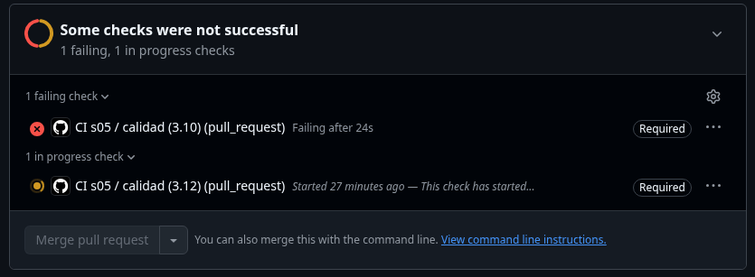

# Evidencia de CI: require status checks (un PR con la suite en rojo no se puede mergear)

Workflow: `.github/workflows/ci-s05.yml` (en la raíz del monorepo). Corre
`ruff`, `mypy` y `pytest` en Python 3.10 y 3.12, y se ejecuta en todo PR a `main`.

Regla: ruleset `proteger-main` sobre `main`.


## La regla


Para garantizar la estabilidad del código en producción y evitar regresiones en la rama principal, se configuró el ruleset **`proteger-main`** sobre `main`. Este ruleset establece cuatro políticas clave:

1. **Pull Request obligatorio antes de mergear (*Require a pull request before merging*):** Deshabilita los pushes directos sobre `main`. Cualquier cambio debe integrarse mediante un PR, asegurando trazabilidad y revisión.
2. **Status checks obligatorios (*Require status checks to pass*):** Exige que los trabajos de la matriz de CI, específicamente **`calidad (3.10)`** y **`calidad (3.12)`**, terminen con éxito antes de habilitar la integración.
3. **Bloqueo de push forzado (*Block force pushes*):** Impide el uso de `git push --force`, protegiendo el historial lineal y evitando la sobrescritura accidental de commits existentes.
4. **Protección contra eliminación (*Restrict deletions*):** Impide que la rama `main` pueda ser borrada por error.

### ¿Por qué exigir checks tanto en Python 3.10 como en 3.12?
Ejecutar la matriz sobre ambas versiones garantiza compatibilidad entre entornos:
* **Python 3.10** actúa como la versión base de soporte extendido (típica en servidores o entornos heredados estables).
* **Python 3.12** representa la versión más moderna del lenguaje, donde librerías externas pueden presentar advertencias de obsolescencia (*deprecation warnings*), cambios en el motor de tipado estático con `mypy` o variaciones en dependencias. 

Exigir ambos asegura que el código sea reproducible y portable, evitando que una solución válida en local falle al desplegarse en entornos con versiones distintas de Python.

> **Nota técnica:** Un ruleset que únicamente exija un Pull Request pero carezca de *status checks obligatorios* no protege realmente a `main`. Permitiría que cualquier desarrollador abra un PR, observe la suite de pruebas en rojo y aun así presione el botón de merge. Los checks requeridos convierten la integración continua en una **compuerta vinculante (*hard gate*)**.

## 🔴 PR bloqueado

Para validar empíricamente que la compuerta del CI bloquea código defectuoso, se introdujo deliberadamente un fallo en `tests/test_union.py` (línea 74):

```python
# Valor original correcto:
assert len(resultado) == 3

# Modificación deliberada para romper el test:
assert len(resultado) == 7
```

El test espera únicamente 3 filas debido a que es el test que comprueba que el join se hizo correctamente y no se duplicaron filas al momento de hacerlo, al cambiar el valor esperado a 7, el test va a dar error ya que nunca se va a generar un df con 7 filas. 

Después se abrió un PR a `main`.



El push a la rama de trabajo se realizó sin inconvenientes, pero al abrir el Pull Request hacia `main`, el CI evaluó el cambio:
* **Checks que fallaron:** Falló únicamente uno de los jobs de la matriz, **`calidad (3.10)`**, mientras **`calidad (3.12)`** quedó en proceso. El job fallido se interrumpió en el paso de `pytest` debido a un `AssertionError`, que se observó en el log.
* **Mensaje de GitHub:** La plataforma marcó los checks con una cruz roja y un círculo naranja. Mostró los avisos: *"Some checks were not successful"* y *"1 failing, 1 in progress checks"*.
* **Bloqueo del merge:** Dado que el ruleset exige ambos checks en estado verde (`success`), el botón de merge quedó completamente deshabilitado.
* **Cierre del PR:** Una vez documentada la evidencia, **el Pull Request se cerró sin mergear**, protegiendo la integridad de `main`.

## Qué cierra esto

Este esquema consolida una estrategia de **defensa en profundidad** distribuida en tres capas sucesivas:

1. **Local interactiva (`pytest`):** Brinda retroalimentación rápida mientras el desarrollador escribe código en su máquina, pero depende enteramente de que la persona recuerde ejecutarla.
2. **Local preventiva (`pre-commit`):** Se dispara automáticamente en cada `git commit` ejecutando 3 hooks definidos en `.pre-commit-config.yaml`:
   - `ruff-check`: lint, errores y malas prácticas.
   - `ruff-format`: formato, estilo visual.
   - `mypy`: que los tipos coincidan con las anotaciones.

   Se puede evadir con `--no-verify`.
3. **Centralizada y vinculante (CI en GitHub Actions + Ruleset):** Se dispara en un contenedor limpio del servidor ante cualquier PR hacia `main`. Al hacer esto main queda protegido, ya que ninguna configuración o bandera local puede anularla.


Gracias al ruleset, cualquier omisión local —sea accidental o forzada mediante `--no-verify`— es neutralizada en el servidor remoto: los tests definen de forma objetiva qué constituye un comportamiento correcto y el ruleset impide que entre a `main` una sola línea que no haya superado la suite completa.
