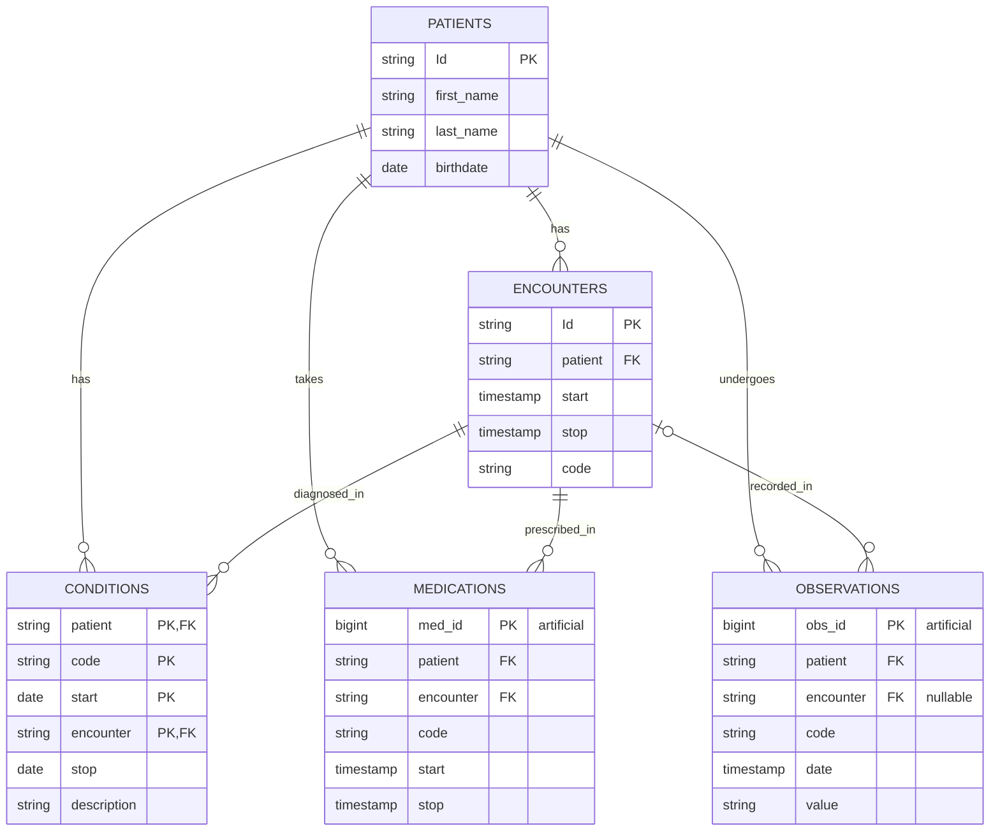

# Diagrama entidad-relación

Diagrama simplificado: solo muestra las columnas clave (PK, FK) y algunas descriptivas.
Los tipos de fecha corresponden a los reales en `clinica.duckdb`.

```mermaid
erDiagram
    PATIENTS ||--o{ ENCOUNTERS : "has"
    PATIENTS ||--o{ CONDITIONS : "has"
    PATIENTS ||--o{ MEDICATIONS : "takes"
    PATIENTS ||--o{ OBSERVATIONS : "undergoes"

    ENCOUNTERS ||--o{ CONDITIONS : "diagnosed_in"
    ENCOUNTERS ||--o{ MEDICATIONS : "prescribed_in"
    ENCOUNTERS o|--o{ OBSERVATIONS : "recorded_in"

    PATIENTS {
        string Id PK
        string first_name
        string last_name
        date birthdate
    }

    ENCOUNTERS {
        string Id PK
        string patient FK
        timestamp start
        timestamp stop
        string code
    }

    CONDITIONS {
        string patient PK, FK
        string code PK
        date start PK
        string encounter PK, FK
        date stop
        string description
    }

    MEDICATIONS {
        bigint med_id PK "artificial"
        string patient FK
        string encounter FK
        string code
        timestamp start
        timestamp stop
    }

    OBSERVATIONS {
        bigint obs_id PK "artificial"
        string patient FK
        string encounter FK "nullable"
        string code
        timestamp date
        string value
    }
```
